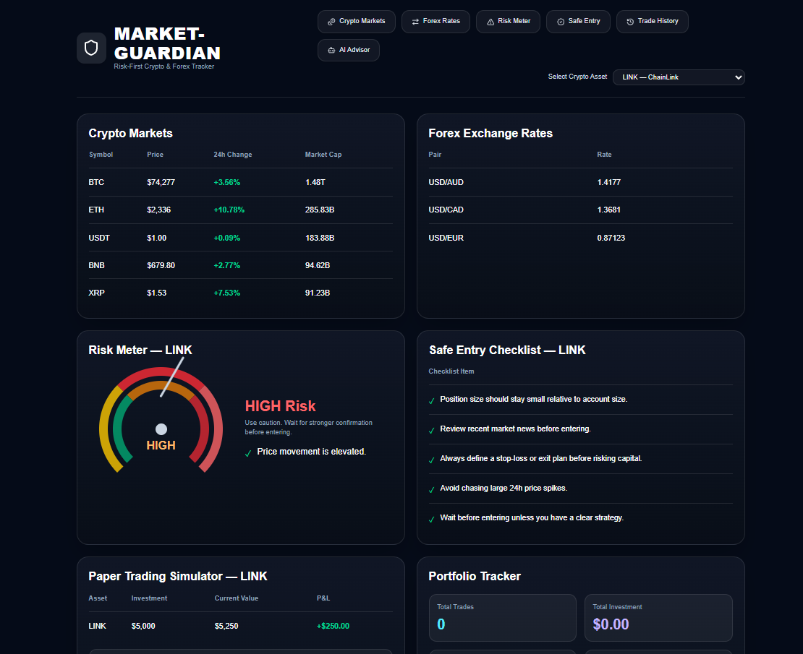
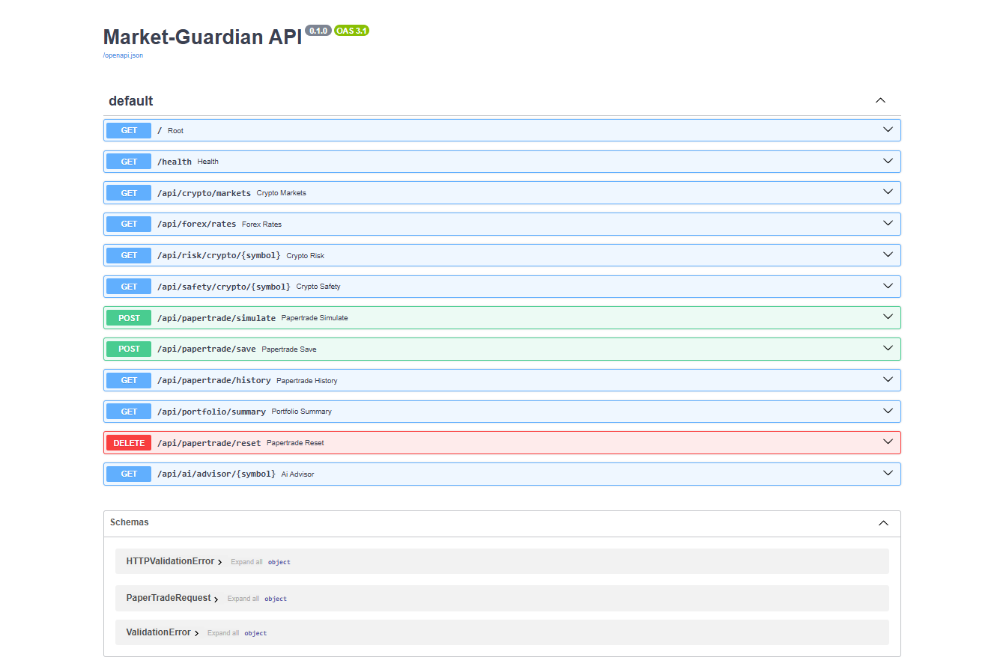
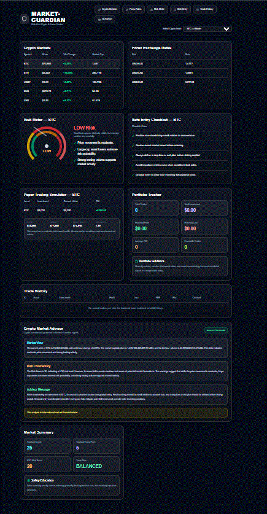
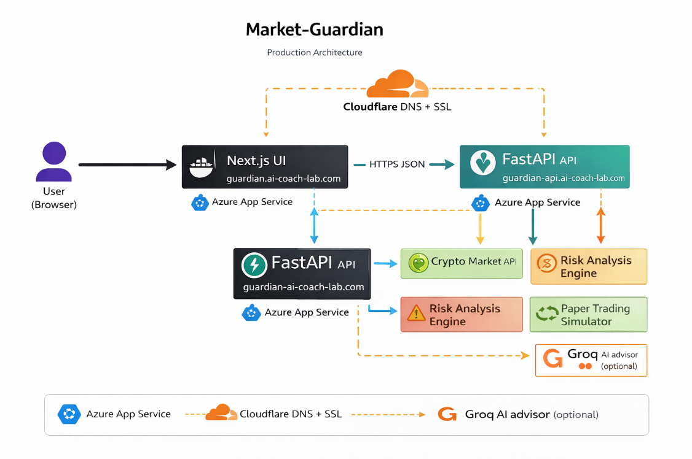

# 🛡️ Market-Guardian

<p align="center">
  
  
  
  
  
  
</p>

**Educational-only risk-first crypto and forex learning assistant.**  
Market-Guardian helps users understand market conditions by turning live crypto and forex data into risk signals, safe-entry guidance, paper-trade simulations, and beginner-friendly commentary.

> ⚠️ **Disclaimer:** This project is for educational purposes only and does not provide financial, trading, or investment advice.

## 🌐 Live Deployment

- **UI**: https://guardian.ai-coach-lab.com  
- **API**: https://guardian-api.ai-coach-lab.com  
- **API Docs**: https://guardian-api.ai-coach-lab.com/docs  

## 🖼️ App Preview

### Next.js UI


### API Documentation (Swagger)


### Demo Walkthrough


### Production Architecture


## ✅ What This App Does

Market-Guardian combines:

- **Crypto market monitoring**
- **Forex exchange-rate tracking**
- **Risk scoring** (low / medium / high)
- **Safe-entry checklist guidance**
- **Paper trading simulation**
- **Portfolio summary and trade history**
- **Optional AI market commentary** via **Groq**

## ✅ Features

| Category | Feature | Description |
|---|---|---|
| Market Data | Crypto market pull | Fetches crypto price, market cap, volume, and 24h change |
| Market Data | Forex rates | Displays real-time currency exchange pairs |
| Risk Analysis | Risk meter | Converts live market conditions into a simple risk level |
| Learning | Safe-entry checklist | Provides plain-English guidance before entering a trade |
| Simulation | Paper trading | Simulates entry, target, stop-loss, and P/L outcomes |
| Portfolio | Trade history | Stores and displays simulated trade activity |
| Portfolio | Portfolio summary | Aggregates total trades, investment, profit/loss, and trade bias |
| Learning | AI advisor | Generates educational market commentary using Groq |
| Platform | UI + API separation | Next.js UI calls FastAPI backend over HTTP/HTTPS |
| Deployment | Cloud-ready | Dockerized and deployed to Azure App Service |

## 🧠 Architecture

### Production

- **Next.js UI (public):** `guardian.ai-coach-lab.com`
- **FastAPI API (public):** `guardian-api.ai-coach-lab.com`
- Cloudflare handles DNS (CNAME)
- Azure App Service handles hosting + SSL

```mermaid
flowchart LR
  U["User (Browser)"] --> UI["Next.js UI<br/>guardian.ai-coach-lab.com"]
  UI -->|HTTPS JSON| API["FastAPI API<br/>guardian-api.ai-coach-lab.com"]
  API --> CRYPTO["Crypto market data"]
  API --> FX["Forex exchange data"]
  API --> RISK["Risk engine"]
  API --> PT["Paper trading logic"]
  API --> AI["Groq AI advisor (optional)"]
